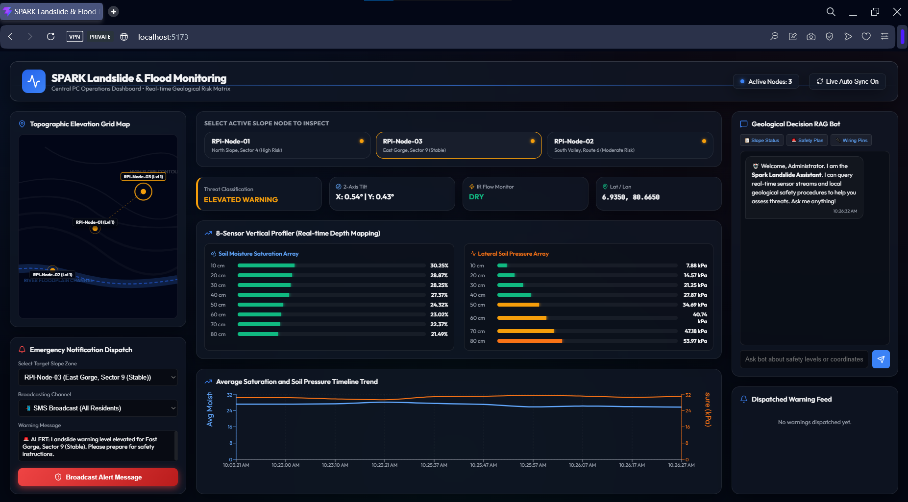

# 📊 Central PC React Dashboard


This is the central control station interface, built in React with Vite. It connects to the central PC Flask backend API (`http://localhost:5000`) and displays geological data, flood threats, and risk trends.

---

## 🎨 Design and Visual Features

- **Stylized Contour Elevation Map:** An interactive, offline SVG topographic contour map showing elevation levels, flood riverbed lanes, and node locations. Nodes pulse with colors matching their live threat index.
- **8-Sensor Vertical Profiler:** Visualizes soil moisture and lateral soil pressure at 8 specific depths (from 10cm down to 80cm) along the rod structure.
- **Timeline Trends:** Recharts-based multi-axis line graphs showing saturation and pressure history, highlighting slope deterioration trends.
- **Dispatched Alerts Feed:** Displays historical logs of warnings sent out to area residents.
- **Manual Alert Dispatcher:** Allows operators to choose a slope sector and broadcast emergency warnings via SMS, email, or physical sirens.
- **RAG Assistant Interface:** An integrated chatbot terminal connecting to the backend RAG engine, allowing operators to run queries.

---

## 🚀 Running the Dashboard

### 1. Install Node Dependencies
Make sure you are in the `central_pc/frontend` folder:
```bash
npm install
```

### 2. Run the Development Server
Run the local dev server:
```bash
npm run dev
```
The application will launch at `http://localhost:5173`. Open this URL in any web browser to view the console.
